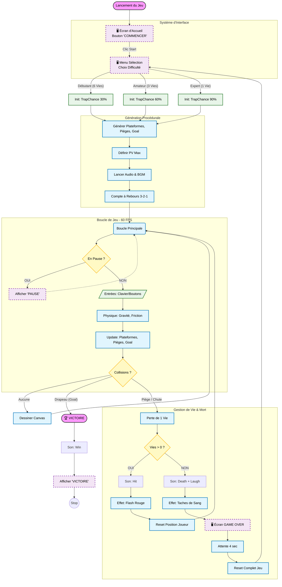

# Projet : "Trap Master" - Un jeu de plateforme impitoyable (HTML5/JavaScript)

**Source d'inspiration :** [Trap Adventure 2](https://www.gamepix.com/fr/play/trap-adventure-2)

## 1. Description du Projet

Ce projet consiste à développer un jeu de plateforme 2D, inspiré par le concept de **"jeu de la mort"** popularisé par des titres comme *Trap Adventure 2*. L'objectif est de créer une expérience de jeu qui met l'accent sur la **mémorisation**, la **réflexion rapide** et la **difficulté imprévisible**. Le jeu, nommé **"Trap Master"**, sera un prototype de quelques niveaux démontrant la faisabilité d'un tel concept.

Le cœur du projet réside dans l'implémentation de **pièges sournois et inattendus** qui ne peuvent être évités qu'en connaissant leur emplacement ou leur déclenchement. Cela exige une conception de niveau minutieuse et une gestion dynamique des événements de jeu.

## 2. Technologies Utilisées

| Technologie | Rôle dans le Projet |
| :--- | :--- |
| **HTML5 Canvas** | Moteur de rendu graphique principal pour dessiner les éléments du jeu (personnage, tuiles, pièges). |
| **JavaScript (ES6+)** | Langage de programmation principal pour la logique du jeu, la gestion des événements et la boucle de jeu. |
| **CSS3** | Style de l'environnement de jeu (conteneur, écran de chargement) et potentiellement pour des animations légères. |
| **Tiled Map Editor** | Outil externe pour la conception des niveaux (création des cartes de tuiles et des couches d'objets pour les pièges). |

## 3. Objectifs Techniques Clés

1.  **Moteur de Jeu de Plateforme Fonctionnel :** Implémenter les mouvements de base du joueur (course, saut, gravité) et la détection de collision en utilisant des algorithmes de physique 2D de base (AABB - Axis-Aligned Bounding Box).
2.  **Gestion des Niveaux et du Rendu :** Utiliser le Canvas pour le rendu des graphismes. Implémenter un système de chargement et d'interprétation des données de niveaux (par exemple, au format JSON exporté par Tiled).
3.  **Mécanismes de Pièges Imprévisibles :**
    * **Pièges à Déclenchement :** Créer des objets (pointes, blocs tombants) qui se manifestent ou s'activent uniquement lorsque le joueur atteint une zone spécifique (trigger invisible).
    * **Pièges à Retardement :** Pièges qui s'activent après un certain temps ou un certain nombre d'actions du joueur.
4.  **Système de "Mort et Recommencement" :** Gérer la détection de collision avec les pièges et les ennemis, et réinitialiser rapidement le niveau pour encourager la mémorisation.
5.  **Gestion des Entrées :** Implémenter la gestion des événements clavier pour les déplacements (flèches ou ZQSD).

## 4. Architecture et Logique du Jeu

Le diagramme ci-dessous illustre la boucle principale du jeu (Core Loop) ainsi que la gestion critique des états de victoire et de défaite (Death System), centrale pour ce type de jeu *Die & Retry*.

## 5. Étapes de Développement (Roadmap)

| Phase | Description | Résultat Attendu |
| :--- | :--- | :--- |
| **Phase 1 : Initialisation et Rendu** | Mise en place de la structure HTML/CSS/JavaScript. Création de la boucle de jeu principale et du rendu sur Canvas. | Un Canvas affichant un personnage statique et un fond de base. |
| **Phase 2 : Mouvement et Physique** | Implémentation de la logique de mouvement du joueur et des algorithmes de gravité et de collision de base. | Un personnage qui peut se déplacer et sauter sur une plateforme statique. |
| **Phase 3 : Niveaux et Pièges** | Intégration des données de niveaux (JSON/Tiled). Développement de la logique des pièges (déclenchement, animation, mort du joueur). | Un niveau jouable avec des pièges fonctionnels et mortels. |
| **Phase 4 : Finition et Documentation** | Ajout d'un écran titre et d'une transition de niveau. Amélioration des graphismes (placeholders). Documentation du code et préparation du dépôt GitHub. | Un prototype complet de "Trap Master" avec 2-3 niveaux et une documentation claire. |

## 6. Résultats et Compétences Démontrées

Ce projet démontre une maîtrise des compétences suivantes :

* **Développement de Jeux 2D *Vanilla* :** Utilisation des technologies web fondamentales (HTML5 Canvas, JavaScript) sans dépendance à un framework lourd.
* **Algorithmes de Physique et de Collision :** Implémentation manuelle des règles de gravité et de détection de collision.
* **Programmation Orientée Objet (POO) :** Structuration du code en classes (Joueur, Piège, Niveau) pour une meilleure maintenabilité.
* **Logique de Jeu Complexe :** Implémentation de mécanismes de jeu basés sur des événements et des conditions complexes (pièges à déclenchement).
* **Gestion de Projet :** Découpage du projet en phases claires et définition d'objectifs techniques précis.
